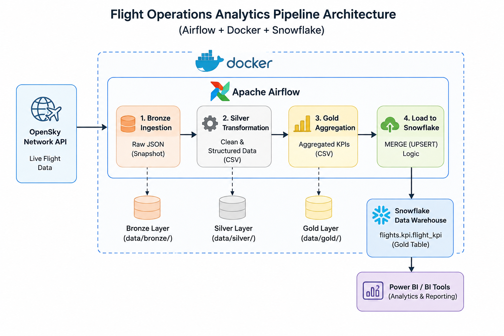

# ✈️ Flight Operations Analytics Pipeline (Airflow + Snowflake)

A production-style data engineering pipeline that ingests live global flight data from the **OpenSky Network API**, processes it using a **Medallion Architecture (Bronze → Silver → Gold)**, and loads aggregated analytics into **Snowflake** for BI consumption.

This project simulates a real-world aviation analytics system used to monitor global air traffic patterns, congestion trends, and country-wise flight activity in near real time.

---

## 📊 Business Overview

Modern aviation analytics systems help organizations:

- Track global air traffic volume trends
- Identify congestion patterns across regions
- Analyze country-wise aviation activity
- Generate time-windowed operational KPIs

This pipeline converts raw flight telemetry into BI-ready datasets for tools like Power BI.

---

## 🏗️ Architecture Overview


```
            OpenSky Network API
                     │
                     ▼
    ┌──────────────────────────────────────┐
    │        Apache Airflow (Docker)       │
    │                                      │
    │  bronze_ingest → silver_transform → │
    │        gold_aggregate               │
    │                  │                   │
    │        load_gold_to_snowflake        │
    └──────────────────────────────────────┘
                     │
                     ▼
          ❄️ Snowflake Data Warehouse
     flights.kpi.flight_kpi (Gold Layer)
                     │
                     ▼
             Power BI / BI Tools
```



---

## 🧱 Data Architecture (Medallion Model)

| Layer | Storage Path | Format | Description |
|-------|-------------|--------|-------------|
| Bronze | `data/bronze/` | JSON | Raw API snapshots (immutable) |
| Silver | `data/silver/` | CSV | Cleaned and structured data |
| Gold | `data/gold/` | CSV | Aggregated KPIs |
| Snowflake | `flights.kpi.flight_kpi` | Table | Final analytics warehouse layer |

---

## ⚙️ Tech Stack

| Tool | Purpose |
|------|---------|
| Apache Airflow | Workflow orchestration & scheduling |
| Python | ETL processing |
| OpenSky API | Live flight data source |
| Snowflake | Cloud data warehouse |
| Docker & Docker Compose | Containerized environment |
| Pandas / NumPy | Data transformation & aggregation |

---

## 📁 Project Structure

```
flight-operations-airflow/
│
├── dags/
│   └── flight_pipeline.py
│
├── scripts/
│   ├── bronze_ingest.py
│   ├── silver_transform.py
│   ├── gold_aggregate.py
│   └── load_gold_to_snowflake.py
│
├── sql/
│   └── create_table.sql
│
├── data/
│   ├── bronze/
│   ├── silver/
│   └── gold/
│
├── logs/
├── plugins/
├── docker-compose.yml
├── requirements.txt
└── README.md
```

---

## 🚀 Pipeline Workflow

Each DAG run (every 30 minutes):

1. **Bronze Ingestion**
   - Fetches live flight data from OpenSky API
   - Stores raw JSON snapshot

2. **Silver Transformation**
   - Cleans and standardizes data
   - Removes nulls and invalid records
   - Converts JSON → structured format

3. **Gold Aggregation**
   - Groups by origin country
   - Calculates KPIs:
     - Total flights
     - Average velocity
     - On-ground count
     - On-ground percentage

4. **Snowflake Load**
   - Loads Gold data into Snowflake
   - Uses MERGE (UPSERT) logic for idempotency

---

## ❄️ Snowflake Schema

```sql
CREATE TABLE flights.kpi.flight_kpi (
    window_start     TIMESTAMP_NTZ,
    origin_country   VARCHAR(100),
    total_flights    INTEGER,
    avg_velocity     FLOAT,
    on_ground_count  INTEGER,
    on_ground_pct    FLOAT,
    load_time        TIMESTAMP_NTZ DEFAULT CURRENT_TIMESTAMP(),
    PRIMARY KEY (window_start, origin_country)
)
CLUSTER BY (window_start);
```

---

## 🔁 Airflow DAG Flow

```
bronze_ingest
      ↓
silver_transform
      ↓
gold_aggregate
      ↓
load_gold_to_snowflake
```

---

## 🛡️ Reliability Features

- Retry mechanism (3 attempts, 5-minute delay)
- Idempotent DAG design (safe re-runs)
- UPSERT logic in Snowflake (no duplicates)
- Time-window based processing (30-minute batches)
- Schema validation during transformation

---

## ❄️ Snowflake Integration

- Connection ID: `flight_snowflake`
- Managed via Airflow Connections
- Data loaded using MERGE-based UPSERT logic
- Ensures no duplicate KPI records

---

## 📊 Sample Gold Output

| origin_country | total_flights | avg_velocity | on_ground_count | on_ground_pct |
|----------------|---------------|--------------|-----------------|---------------|
| United States  | 5842          | 218.4        | 1203            | 20.59%        |
| Germany        | 1104          | 196.2        | 287             | 26.00%        |
| United Kingdom | 982           | 204.7        | 198             | 20.16%        |

---

## 🧠 Key Engineering Decisions

- Medallion architecture for data separation
- 30-minute time-window batching for efficiency
- Snowflake as final analytics warehouse
- Airflow for orchestration and scheduling
- UPSERT logic for safe reprocessing

---

## 💡 Skills Demonstrated

- Data pipeline architecture design
- Apache Airflow DAG development
- API ingestion & processing
- Cloud data warehouse integration (Snowflake)
- Incremental ETL processing
- Dockerized environment setup
- Analytics-ready data modeling

---

## 🔮 Future Improvements

- Add Great Expectations data validation
- Integrate dbt for transformations
- Add Slack/email alerts for failures
- Build Power BI dashboard on Snowflake
- Add CI/CD for DAG deployment
- Fully automate backfill strategy

---

## 👨‍💻 Author

Built by **Shambhu Prasad Sah**  
Focused on Data Engineering, Airflow, and Cloud Data Platforms